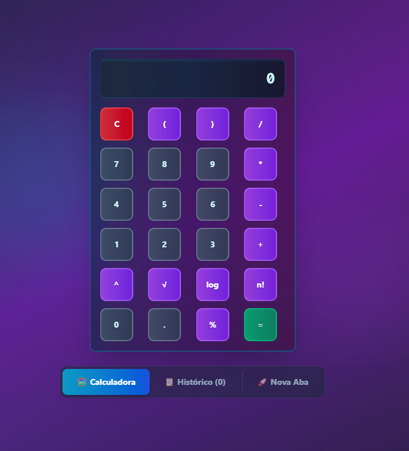

# 🧮 Calculadora Avançada Futurística

Uma calculadora avançada com interface futurística desenvolvida em Next.js, TypeScript e Tailwind CSS, oferecendo funcionalidades científicas e um histórico de cálculos.



## ✨ Características

### 🎯 Funcionalidades Principais

- **Operações Básicas**: Adição, subtração, multiplicação e divisão
- **Operações Científicas**:
  - Potenciação (^)
  - Raiz quadrada (√)
  - Logaritmo base 10 (log)
  - Fatorial (n!)
  - Porcentagem (%)
- **Histórico de Cálculos**: Mantenha registro de todos os seus cálculos
- **Interface Responsiva**: Funciona perfeitamente em desktop e mobile

### 🎨 Design Futurístico

- **Tema Cyberpunk**: Gradientes neon com cores cyan, purple e pink
- **Efeitos Visuais**:
  - Backdrop blur e glass morphism
  - Animações smooth e hover effects
  - Scanline effects no display
  - Efeitos de brilho nos botões
- **Layout Intuitivo**: Botões organizados no padrão tradicional de calculadoras

### 🛡️ Recursos Avançados

- **Tratamento de Erros**: Detecção de divisão por zero e expressões inválidas
- **Validação de Entrada**: Sanitização automática de expressões
- **Histórico Interativo**: Clique em qualquer cálculo anterior para reutilizá-lo
- **Multi-tab Interface**: Navegação entre calculadora e histórico

## 🚀 Tecnologias Utilizadas

- **Next.js 15.5.2** - Framework React para produção
- **React 19.1.0** - Biblioteca para interfaces de usuário
- **TypeScript** - Tipagem estática para JavaScript
- **Tailwind CSS 4** - Framework CSS utilitário
- **Radix UI** - Componentes primitivos acessíveis
- **Drizzle ORM** - ORM TypeScript para banco de dados
- **Neon Database** - Banco de dados PostgreSQL serverless

## 📦 Instalação

1. **Clone o repositório**

   ```bash
   git clone https://github.com/seu-usuario/calculadora-avancada.git
   cd calculadora-avancada
   ```

2. **Instale as dependências**

   ```bash
   npm install
   ```

3. **Configure as variáveis de ambiente**

   ```bash
   cp .env.example .env.local
   # Configure suas variáveis de ambiente
   ```

4. **Execute o servidor de desenvolvimento**

   ```bash
   npm run dev
   ```

5. **Acesse a aplicação**
   ```
   http://localhost:3000
   ```

## 🎮 Como Usar

### Operações Básicas

- Digite números e operadores (+, -, \*, /) normalmente
- Pressione `=` para calcular o resultado
- Use `C` para limpar a calculadora

### Operações Científicas

- **Potenciação**: Digite `base^expoente` (ex: `2^3`)
- **Raiz Quadrada**: Digite `√número` (ex: `√16`)
- **Logaritmo**: Digite `log número` (ex: `log100`)
- **Fatorial**: Digite `número!` (ex: `5!`)
- **Porcentagem**: Digite `número%` (ex: `50%`)

### Histórico

- Navegue para a aba "📋 Histórico" para ver todos os cálculos
- Clique em qualquer item do histórico para reutilizar o resultado
- Use "Limpar" para apagar todo o histórico

## 🏗️ Estrutura do Projeto

```
src/
├── app/
│   ├── api/history/          # API para histórico
│   ├── globals.css           # Estilos globais
│   ├── layout.tsx           # Layout principal
│   └── page.tsx             # Página inicial
├── components/
│   ├── ui/                  # Componentes de UI (shadcn/ui)
│   └── calculator.tsx       # Componente principal da calculadora
├── db/
│   ├── db.ts               # Configuração do banco
│   └── schema.ts           # Schema do banco de dados
└── lib/
    └── utils.ts            # Utilitários
```

## 🎨 Customização

### Cores do Tema

As cores principais podem ser modificadas em `globals.css`:

- **Primária**: Cyan (#06b6d4)
- **Secundária**: Purple (#8b5cf6)
- **Accent**: Pink (#ec4899)
- **Background**: Dark slate gradients

### Layout dos Botões

O layout pode ser customizado editando o array `buttonLayout` em `calculator.tsx`:

```typescript
const buttonLayout = [
  ["C", "(", ")", "/"],
  ["7", "8", "9", "*"],
  ["4", "5", "6", "-"],
  ["1", "2", "3", "+"],
  ["^", "√", "log", "n!"],
  ["0", ".", "%", "="],
];
```

## 🧪 Testes

```bash
# Executar linting
npm run lint

# Build de produção
npm run build

# Executar em produção
npm start
```

## 🤝 Contribuição

1. Faça um fork do projeto
2. Crie uma branch para sua feature (`git checkout -b feature/AmazingFeature`)
3. Commit suas mudanças (`git commit -m 'Add some AmazingFeature'`)
4. Push para a branch (`git push origin feature/AmazingFeature`)
5. Abra um Pull Request

## 📝 Licença

Este projeto está sob a licença MIT. Veja o arquivo `LICENSE` para mais detalhes.

## 🎯 Funcionalidades Futuras

- [ ] Mais operações científicas (sin, cos, tan)
- [ ] Modo calculadora de programador (hex, bin, oct)
- [ ] Temas customizáveis
- [ ] Atalhos de teclado
- [ ] Export/import do histórico
- [ ] Calculadora de unidades
- [ ] Modo dark/light toggle

## 👨‍💻 Autor

Desenvolvido com ❤️ por [Seu Nome]

---

⭐ Se você gostou deste projeto, deixe uma estrela!

🐛 Encontrou um bug? [Abra uma issue](https://github.com/seu-usuario/calculadora-avancada/issues)

💡 Tem uma sugestão? [Contribua com o projeto](#-contribuição)
